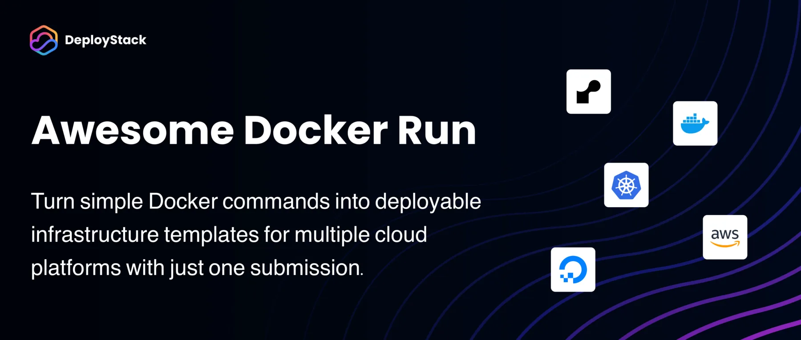

  

A curated collection of Docker run commands that can be easily deployed via [DeployStack](https://deploystack.io).

## Table of contents

<!-- TOC_START -->
- [What is this?](#what-is-this)
- [How it works](#how-it-works)
- [How to contribute](#how-to-contribute)
- [Community](#community)
- [Applications](#applications)
  - [Web Server](#web-server)
- [License](#license)
<!-- TOC_END -->

## What is this?

awesome-docker-run is a community-driven repository of Docker run commands for various applications. Each command is automatically integrated with DeployStack, enabling one-click deployment to multiple cloud platforms.

## How it works

1. Browse the applications in this repository
2. Find an application you want to deploy
3. Click on the DeployStack button to deploy it instantly
4. Or use the Docker run command directly on your own system

## How to contribute

We welcome contributions! To add your Docker run command:

1. Fork this repository
2. Create a new directory under `commands/` with your application name
3. Add a `docker-run.md` file with your Docker run command
4. Submit a pull request

See [CONTRIBUTING.md](CONTRIBUTING.md) for detailed instructions.

## Community

- Join our [Discord community](https://discord.gg/42Ce3S7b3b)
- Follow us on [Twitter / X](https://x.com/DeployStack)
- Check out [DeployStack](https://deploystack.io) for more deployment tools

## Applications

<!-- APPLICATIONS_START -->

### Web Server

- [nginx](commands/nginx/) - The official NGINX Open Source repository.

<!-- APPLICATIONS_END -->

## License

This repository is licensed under the MIT License - see the [LICENSE](LICENSE) file for details.
